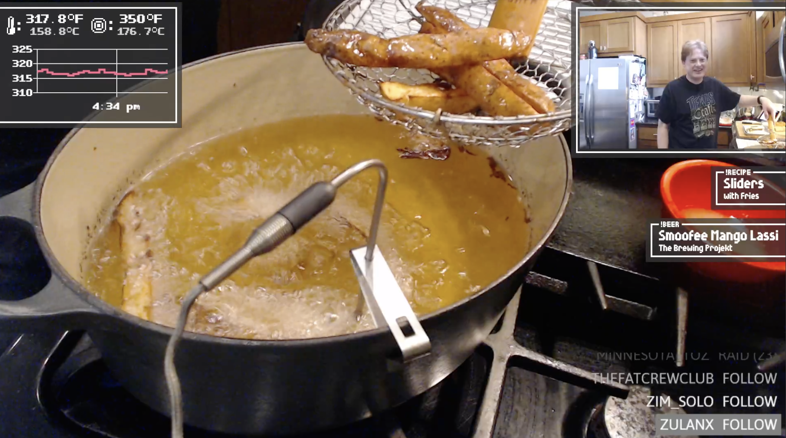
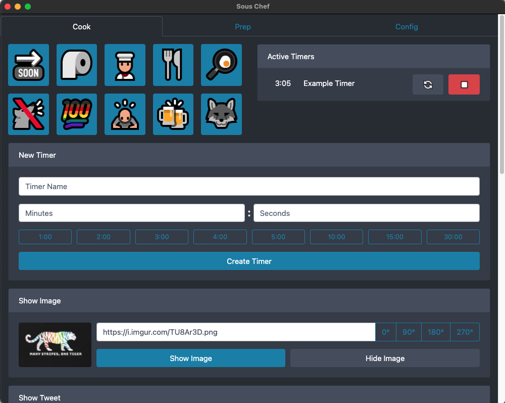

# Sous Chef, The Cooking Stream Companion App

Sous Chef is an comprehensive companion application for hosting cooking shows on the Twitch livestreaming platform. It integrates with every aspect of the livestreaming experience, providing animated video overlays for rendering show graphics, a web-based control panel for managing the show from desktop or mobile browsers, and integration with Twitch's chat functionality for engaging with audiences.

The application is built upon a variety of open source tools, including Electron, Express, Socket.io, React, Webpack, and Bootstrap. Sous Chef has a modular architecture, allowing pieces to be added or removed depending on the host's particular needs. It was developed in collaboration with [@AndrewCooksLive](http://twitter.com/andrewcookslive), and its code can be found on this [GitHub](https://github.com/imstuartjones/sous-chef). Icons and graphics were provided by the [Mutant Standard](https://mutant.tech/) alternative emoji set.

A full writeup of Sous Chef's background can be found on [my site](https://stuart-jones.com/sous-chef-the-cooking-stream-companion-app).

# How to Develop

Clone the Github repository to your local computer. Install the application's dependencies with `npm install`, then run the app with `npm run dev`. The Sous Chef application is split into two portions: A Create-React-App frontend, and a Electron/Express backend. If for some reason you need to run one of these pieces in isolation, `npm start` kicks off the frontend startup script, and `npm run electron` starts the boots the backend. When you're ready to compile the application, run `npm run package` to kick off Electron Froge's packaging script.